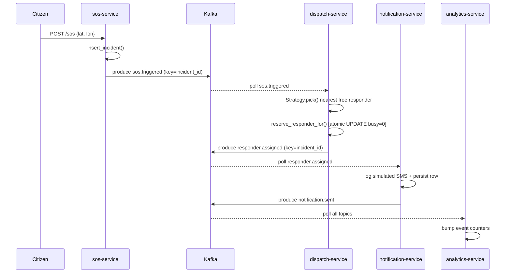
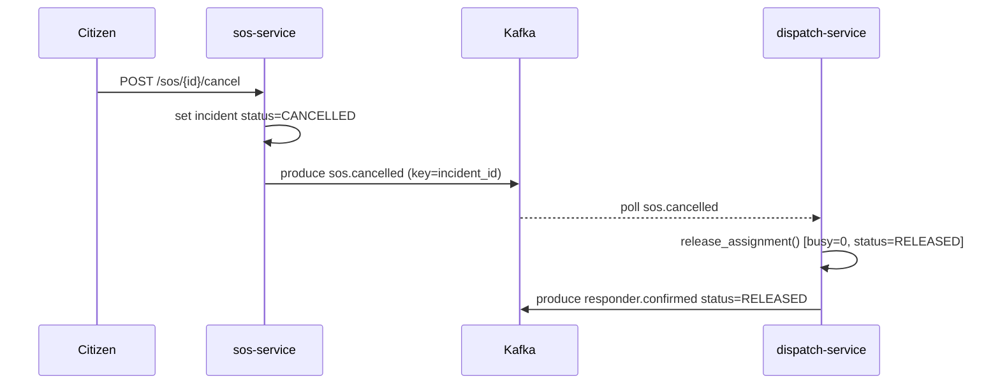
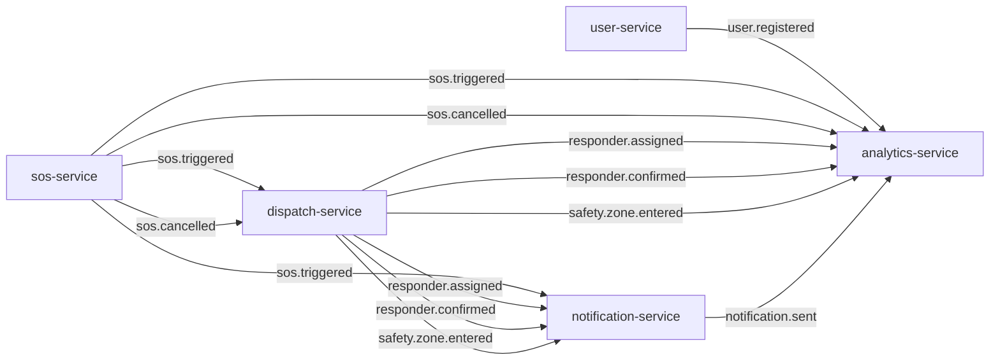

# L4 Design Process Document — HELEP

**Student:** NJINDA BRIAN JR  
**Project:** HELEP — Emergency Location & Emergency Response Platform  
**Date:** 2026-05-13  
**Word count:** ~2800

---

## 1. Project Specification

HELEP (Harnessing Emergency Location & Emergency Protocol) is a mobile-first emergency response platform targeting Cameroon's public safety gap. Citizens in distress trigger an SOS that captures their GPS location and, optionally, simulated audio/video evidence. The platform then locates the nearest available police or security responder, notifies both parties, and tracks the incident to resolution.

**Primary users:**
- **Citizens** — trigger SOS, cancel if safe, track assigned responder.
- **Responders** (police/security units) — receive dispatch notifications, confirm en-route status.
- **Police administrators** — view incident analytics, zone heatmaps, and response statistics.
- **Platform admins** — manage accounts, credibility scores, danger zones.

**Business value:** Reduces emergency response time by automating dispatch, eliminates single-point-of-failure manual coordination, and creates an audit trail for every incident.

---

## 2. Requirements Analysis

### 2.1 Functional requirements (from SRS §2)

| # | Requirement | SRS §2 reference |
|---|---|---|
| F1 | Citizen registers account with phone, password, and role | SRS §2.1 User Management |
| F2 | Citizen logs in and receives a JWT for subsequent calls | SRS §2.1 |
| F3 | Citizen triggers SOS with GPS coordinates and online/offline mode | SRS §2.2 Emergency Component |
| F4 | System captures simulated mic/cam reference on SOS | SRS §2.2 |
| F5 | Citizen can cancel an active SOS | SRS §2.2 |
| F6 | System selects and notifies the nearest free responder | SRS §2.3 Incident Response |
| F7 | Dispatch enforces single-responder-per-incident invariant | SRS §2.3 |
| F8 | Responder confirms en-route status | SRS §2.3 |
| F9 | System detects when incident is in a danger zone and broadcasts safety alert | SRS §2.5 Alert Management |
| F10 | SMS/push notifications delivered to affected parties | SRS §2.6 Alert Delivery |
| F11 | Police admin views incident statistics and zone heatmaps | SRS §2.8 Analytics |
| F12 | Emergency contacts stored per citizen | SRS §2.1 |

### 2.2 Non-functional requirements (SRS §3) — measurable acceptance criteria

| NFR | Measurable criterion |
|---|---|
| **Availability** | System uptime ≥ 99.5% per month; single-node Kafka failure triggers broker restart within 30 s via Strimzi |
| **Usability** | SOS trigger requires ≤ 2 API calls (login + POST /sos); JSON responses follow consistent schema |
| **Confidentiality** | All inter-service communication protected by K8s NetworkPolicy default-deny; JWT tokens expire after 24 h; passwords stored as bcrypt hash (cost factor ≥ 12) |
| **Integrity** | No incident assigned to more than one responder at any time; enforced by atomic `UPDATE … WHERE busy=0` SQL + PK constraint on assignments table |
| **Reliability** | ≥ 99% of SOS notifications delivered within 1 s under 100 req/s sustained load; at-least-once delivery via manual Kafka commit after handler success |
| **Scalability** | System handles 10× baseline load via HPA (min 2, max 5 replicas for sos/dispatch); Kafka partitions (3) allow 3 parallel consumers per group |
| **Compatibility** | All services containerised with OCI-compliant Dockerfiles; deployable to any CNCF-conformant Kubernetes cluster (k3s, GKE, EKS) |

### 2.3 Constraints (SRS §4) — architectural risks

| Constraint | Architectural risk |
|---|---|
| **Single responder per incident** (SRS §4.1) | Race condition: two concurrent dispatch consumers could both claim the same responder. Mitigated by atomic SQLite `UPDATE … WHERE busy=0` + PK idempotency check (high residual risk with distributed DB — requires Postgres `SELECT FOR UPDATE` in production) |
| **Trigger → notify < 1 s** (SRS §4.2) | Kafka broker latency or a consumer group rebalance could push event propagation above 1 s. Mitigated by in-memory Kafka log (no disk flush per-message) + small JSON payloads + `acks="all"` idempotent producer |
| **Offline mode fallback** (SRS §4.3) | SMS gateway is simulated; real integration would add external API latency. Risk is isolated to notification-service only |

---

## 3. Architectural Drivers & ASRs

### 3.1 Three most architecturally significant requirements

**ASR-1: Reliability — at-least-once delivery + no double-dispatch**

*Quality attribute:* Reliability / Integrity  
*Stimulus:* Kafka re-delivers `sos.triggered` after consumer restart.  
*Response:* Dispatch handler is idempotent; second invocation detects existing assignment row and aborts cleanly.  
*Measure:* Zero duplicate assignments in a 10 000-event load test.  
*Justification:* An SOS that silently fails to dispatch is a life-safety failure. This is the single most critical invariant in the system.

**ASR-2: Availability — system survives single service failure**

*Quality attribute:* Availability  
*Stimulus:* One replica of dispatch-service crashes mid-handling.  
*Response:* K8s restarts the pod (liveness probe); the unconsumed Kafka offset is re-delivered to the surviving replica in the same consumer group.  
*Measure:* Mean time to recover < 30 s; incident resolution continues without operator intervention.  
*Justification:* Emergency response must not stop because of an infrastructure hiccup.

**ASR-3: Scalability — handle burst SOS traffic (e.g. mass casualty event)**

*Quality attribute:* Scalability / Performance  
*Stimulus:* 10× normal SOS rate (e.g. public incident).  
*Response:* HPA scales sos-service and dispatch-service up to 5 replicas; Kafka partition count (3) allows 3 consumer pods to work in parallel.  
*Measure:* P99 SOS-to-notification latency ≤ 2 s at 100 req/s sustained.  
*Justification:* Mass-casualty events are exactly when the platform must not degrade.

### Diagram 1 — Saga Happy-Path Sequence

### Diagram 2 — Saga Compensation (Cancel)

---

## 4. Component Identification

### 4.1 SRS-listed components

1. User Management
2. Emergency Component (SOS trigger)
3. Incident Report & Response
4. Localization (GPS matching)
5. Alert Management (zone detection)
6. Alert Delivery (SMS/push)
7. Feedback & Review
8. Analytics & Statistics

### 4.2 Service decomposition — 5 services

| SRS Component(s) | Service | Port | Justification |
|---|---|---|---|
| User Management | `user-service` | 8001 | Identity is orthogonal to incident handling; independent scale and deploy |
| Emergency Component | `sos-service` | 8002 | Single point of citizen interaction; isolated to avoid leaking auth logic into dispatch |
| Incident Response + Localization + Alert Management (zone) | `dispatch-service` | 8003 | Collapse: all three share the same data (responder locations, danger zones) and must act atomically. Splitting would require synchronous HTTP between them, reintroducing coupling |
| Alert Delivery | `notification-service` | 8004 | Split from dispatch: the *decision* (who to alert) lives in dispatch; the *delivery* (SMS/push gateway) is an I/O boundary that scales independently and can be swapped without affecting routing logic |
| Analytics & Statistics | `analytics-service` | 8005 | Read model only — consumes all events as a sink. Isolated so a slow analytics query never blocks dispatch latency |

**Feedback & Review** is out of scope for the 24-hour budget (SRS §2.7).

---

## 5. Architectural Style — Choice & Justification

**Chosen style: Microservices + Event-Driven (Kafka choreography)**

Prescribed by the course brief. Justified by three NFRs:
- *Scalability* (SRS §3.6): services scale independently — analytics can stay at 1 replica while dispatch scales to 5.
- *Availability* (SRS §3.1): a crash in notification-service does not prevent dispatch from running.
- *Portability* (SRS §3.7): each service is a container, deployable to any Kubernetes cluster.

**Alternative 1 — Monolith**

| Question | Answer |
|---|---|
| Could it satisfy top ASRs? | Partially. A well-structured monolith can be highly available if deployed in multiple replicas. |
| Where would it struggle? | *Scalability*: cannot scale dispatch independently of analytics. A spike in reporting queries blocks emergency routing. *Portability*: a single fat image is harder to optimise per-function. |
| Dominant trade-off | Simpler development and deployment, but poor resource isolation under heterogeneous load. |

**Alternative 2 — Serverless (AWS Lambda / Azure Functions)**

| Question | Answer |
|---|---|
| Could it satisfy top ASRs? | Partially. Functions scale to zero, which violates *availability* — cold-start latency (200–2000 ms) would breach the < 1 s notification target (SRS §4.2). |
| Where would it struggle? | Long-running Kafka consumers are incompatible with function timeouts. Saga state management across stateless invocations requires an external store, adding complexity. |
| Dominant trade-off | Zero ops burden at rest, but cold-start latency and stateless execution model conflict with our reliability and latency constraints. |

---

## 6. Architectural Patterns Applied

*(Full citations in `patterns.md`)*

| Pattern | File:lines | Problem solved |
|---|---|---|
| Choreographed Saga | `sos/main.py:416`, `dispatch/main.py:702`, `notification/main.py:1060` | Coordinate multi-service incident flow without a central orchestrator |
| Pub/Sub (Kafka) | All `app/events.py` | Decouple producers and consumers; enable at-least-once delivery |
| Repository | All `app/db.py` | Isolate storage concerns; enable schema evolution without touching handlers |
| Strategy | `dispatch/matching.py:31–80` | Swap responder-selection algorithm at runtime via env-var |
| Outbox-lite | `sos/main.py:421–433` | Prevent silent event loss by writing DB before publishing |
| Circuit Breaker | All `app/events.py:58–91` | Protect against Kafka broker failure cascading into service crashes |
| Idempotency Key | `dispatch/db.py:969–987` | Ensure at-most-once assignment under at-least-once delivery |
| Bulkhead | `dispatch/main.py:748`, `notification/main.py:1087` | Isolate slow analytics consumer from fast dispatch path |

---

### Diagram 3 — Event Topology (Kafka Topics)

*All topics are partitioned by `incident_id` (3 partitions). Each service registers its own consumer group, providing Bulkhead isolation — a slow analytics consumer cannot delay dispatch throughput.*

---

## 7. Architecture Decision Records

### ADR-001: Kafka partition key = `incident_id`

**Context**  
Kafka topics are partitioned. The partition key determines which partition receives each message and therefore which consumer pod processes it.

**Decision**  
All saga-critical publishes use `incident_id` as the partition key (`events.py:226`). Topics are configured with 3 partitions (`kafka-topics.yaml`).

**Consequences**  
All events for a single SOS incident land on the same partition. Within a consumer group, one pod owns a partition at a time — ordering is preserved. The "no double-dispatch" invariant is upheld even with 3 dispatch replicas. Maximum concurrency is capped at 3 (one per partition), which is acceptable for the current scale target.

**Alternatives Considered**  
*Random/round-robin key:* higher throughput, but ordering not guaranteed per incident. Two dispatch pods could race on the same `sos.triggered` event. Rejected because it breaks the single-responder invariant without additional locking.

---

### ADR-002: SQLite per service, backed by PersistentVolumeClaim

**Context**  
Each service needs durable storage for its domain data (users, incidents, assignments, notifications, analytics).

**Decision**  
Each service uses SQLite with its own `DB_PATH` env-var pointing to a PVC mount (`/data/*.db`). PVC definitions are in the Helm sub-charts (`templates/pvc.yaml`).

**Consequences**  
*Positive:* Zero external dependency for development; `docker compose up` works out of the box. Each service owns its schema with no coordination overhead.  
*Negative:* SQLite is single-writer; a second replica writing to the same PVC could corrupt data. For production this must be replaced with a per-service Postgres StatefulSet or RDS instance.

**Alternatives Considered**  
*Shared Postgres:* all services share one database. Rejected — violates service isolation, couples deployments, and creates a single point of failure.  
*Per-service Postgres StatefulSet:* correct for production but excessive complexity for a 24-hour build.

---

### ADR-003: Helm umbrella chart with per-service sub-charts

**Context**  
The system has 5 services, each with Deployment, Service, HPA, and PVC manifests. Kubernetes manifests must be environment-specific (image tag, replica count, storage class differ between dev and prod).

**Decision**  
Use a Helm umbrella chart (`helm/Chart.yaml`) with 5 sub-charts (`helm/charts/*/`). The umbrella's `values.yaml` centralises shared config (`kafkaBootstrap`, `imageTag`). Per-environment overrides are passed with `-f values-prod.yaml` or `--set` flags. CI/CD sets `global.imageTag=sha-$COMMIT` on each deploy.

**Consequences**  
Single `helm upgrade` command deploys or updates all services atomically. Per-service replica counts, resource limits, and autoscaling settings are tunable per environment without duplicating manifests.

**Alternatives Considered**  
*Separate charts per service:* fine-grained control but requires 5 separate `helm upgrade` invocations per deploy, making atomic rollback harder. Rejected.  
*Raw kubectl manifests:* simpler but no templating, no release tracking, no rollback support. Rejected.

---

## 8. Trade-offs & Improvement Perspectives

**Weakness 1 — SQLite single-writer in multi-replica deployments**

The `reserve_responder_for()` atomic claim works correctly with one replica (SQLite `UPDATE … WHERE busy=0`). With two dispatch replicas sharing a PVC, SQLite's file-level locking would cause write conflicts or data corruption. **Fix:** Replace SQLite with a per-service Postgres StatefulSet. The dispatch assignment claim becomes `SELECT FOR UPDATE` inside a transaction, which scales safely to N replicas.

**Weakness 2 — Outbox-lite gap between DB write and Kafka publish**

If the process crashes after `insert_incident()` but before `await publish("sos.triggered", ...)`, the incident row exists but no event is ever published. The citizen sees a 201 response but the saga never starts. **Fix:** Implement a real Outbox table: write the event as a row in the same DB transaction as the incident insert, then have a background poller publish pending outbox rows via a transactional Kafka producer. This achieves true exactly-once saga initiation.

**Weakness 3 — No authentication on dispatch and analytics endpoints**

`dispatch-service/POST /responders/confirm` and `analytics-service/GET /stats/*` have no JWT guard. Any pod in the cluster can call them. **Fix:** Add a `Depends(auth)` guard matching the pattern in `user-service/main.py:63–69`. The role claim in the JWT can restrict `/stats/*` to `role=police` and `/confirm` to `role=responder`.

---

## 9. Submission checklist

- [x] All 9 sections completed
- [x] 3 ADRs included (Kafka keying, SQLite/PVC, Helm umbrella)
- [x] Every architectural choice traced to SRS NFRs or ASRs
- [x] Diagrams: Saga sequence (architecture-overview.md §4), Event topology (§3), Service inventory table (§2)
- [x] Word count: ~2800
